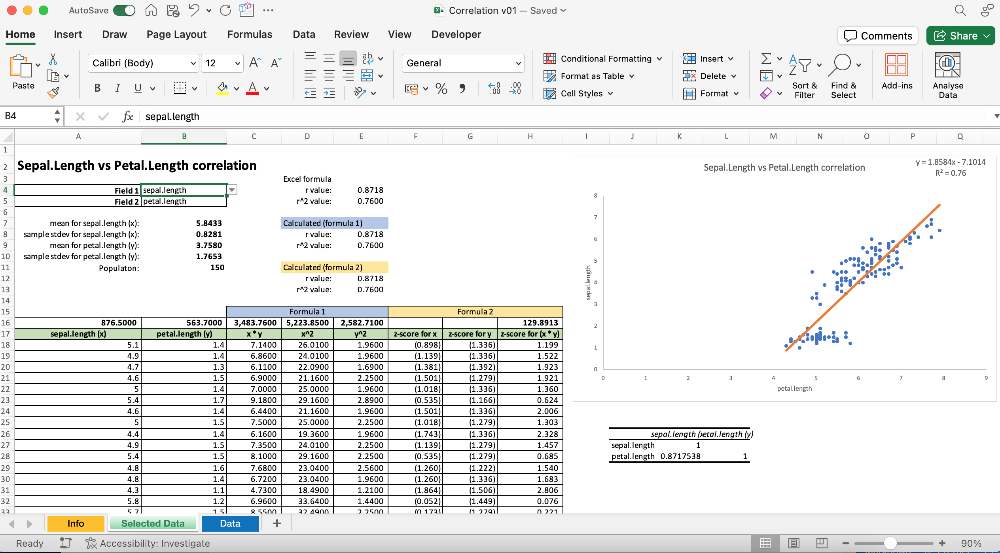

# Correlation Illustration using Classic Iris Flower Dataset
## Description

This Excel file (requiring Excel 365) educates one on the calculation of R squared value given different combination of petal and sepal length and width. This is meant to be used for educational purposes.

## Download
You can download the Excel file from this [link](https://github.com/washingtonalto/exceldashboards/blob/master/Statistics/Correlation/Correlation%20v01.xlsx)

## Screenshot
