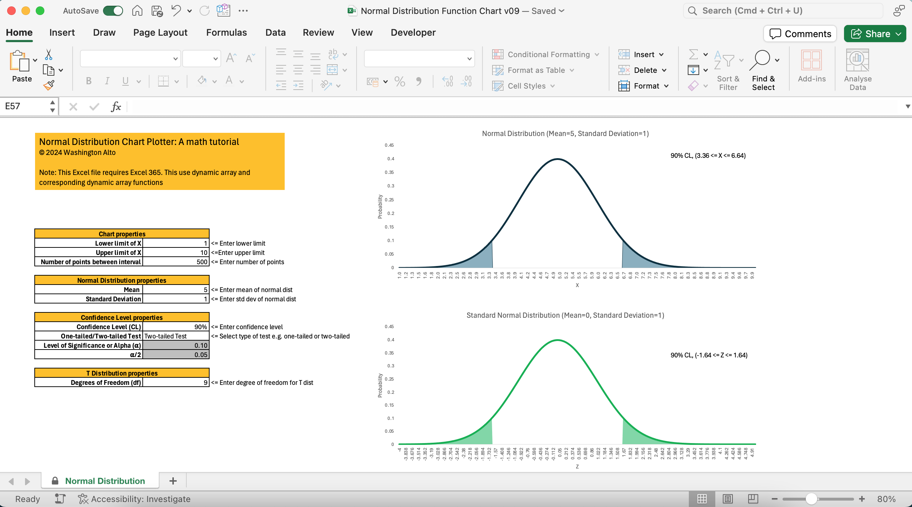

# Normal Distribution: Dynamic Chart

## Description
This Excel file which requires the use of Excel 365 shows dynamic chart capabilities to plot normal distribution curve with areas under the curve. Dynamic charts are not typically built-in in Excel but with the right know-how, this can be done. 

This is meant to be an educational tool where one can play around with various values and the corresponding charts to the right will be dynamically changed accordingly. 

The topmost chart is the normal curve followed by standard normal curve that's standardized based on the mean and standard deviation. The last chart shows the differences between the standard normal distribution and the T distribution especially when the degrees of freedom is less than 30. When the degrees of freedom is greater than 30, the convention is to use the standard normal distribution unless the population standard deviation is unknown.

## Download
You can download the Excel file from this [link](https://github.com/washingtonalto/exceldashboards/blob/master/Statistics/Normal%20Distribution/Normal%20Distribution%20Function%20Chart%20v09.xlsx)

## Screenshot
