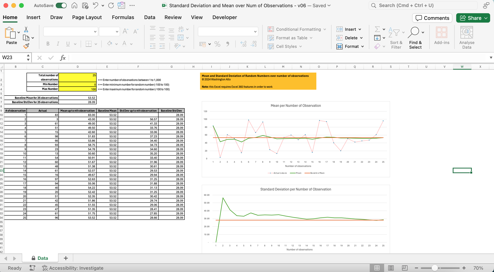

# Sample Mean and Standard Deviation vs Population Mean and Standard Deviation

## Description
This Excel file (which requires use of Excel 365) illustrates the concept that as more observations is added, the closer the sample mean and sample standard deviation is to the population mean and standard deviation. The file makes use of Excel's random number generator for this. It's noteworthy that while more observation is always better, the difference between sample standard deviation and population standard deviation won't differ too much after certain number of observation. This file is meant to be for educational purpose only. 

## Download
You can download the Excel file from this [link](https://github.com/washingtonalto/exceldashboards/blob/master/Statistics/Sample%20Mean%20and%20Std%20Dev%20vs%20Population/Standard%20Deviation%20and%20Mean%20over%20Num%20of%20Observations%20-%20v06.xlsx)

## Screenshot
