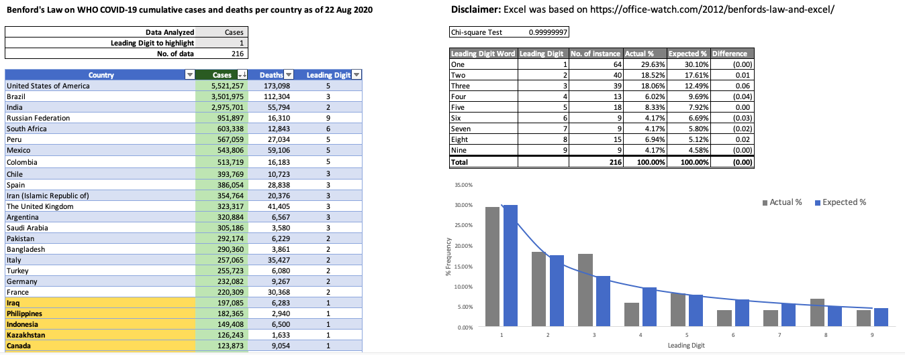

# Benford's Law on WHO COVID-19 cases and deaths

## Description

I modified the Excel file based on https://office-watch.com/2012/benfords-law-and-excel/ to see how Benford's Law work as it's my first time to hear about this and I wanted to understand what it is all about when this was first mentioned by my high school batchmate in a group chat. I'm sharing this so that others can download and understand how this works and how it can be applied to detect potential fraudulent data.

## Download
You can download the Excel file from this [link](https://github.com/washingtonalto/exceldashboards/blob/master/benfords_law/Benford%20Law%20-%20COVID-19%20WHO%20Data.xlsx)

## Screenshot
