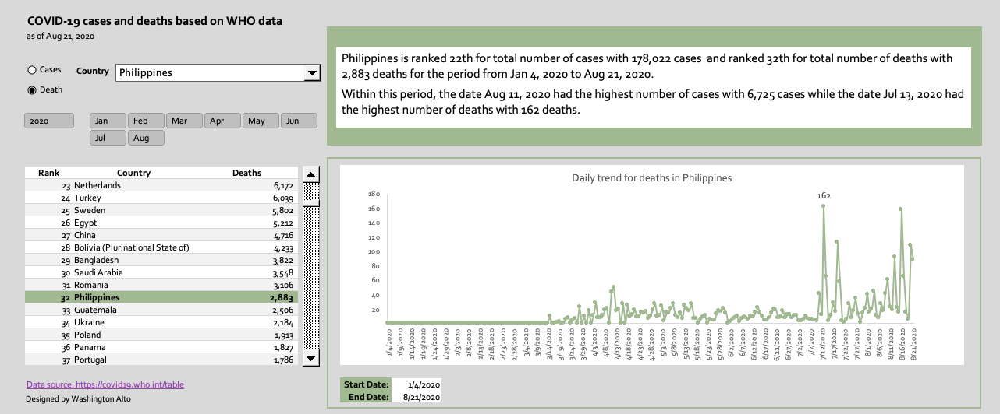
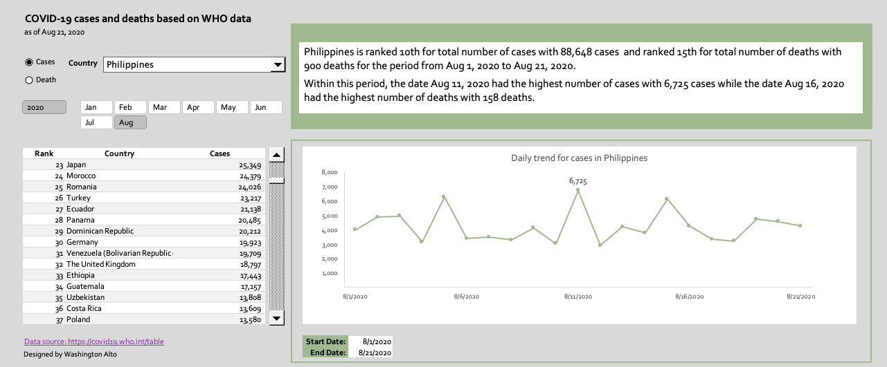
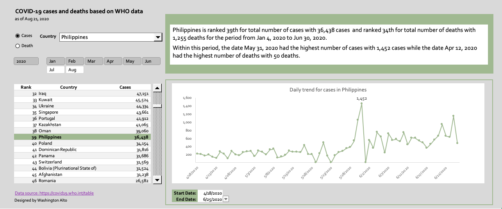
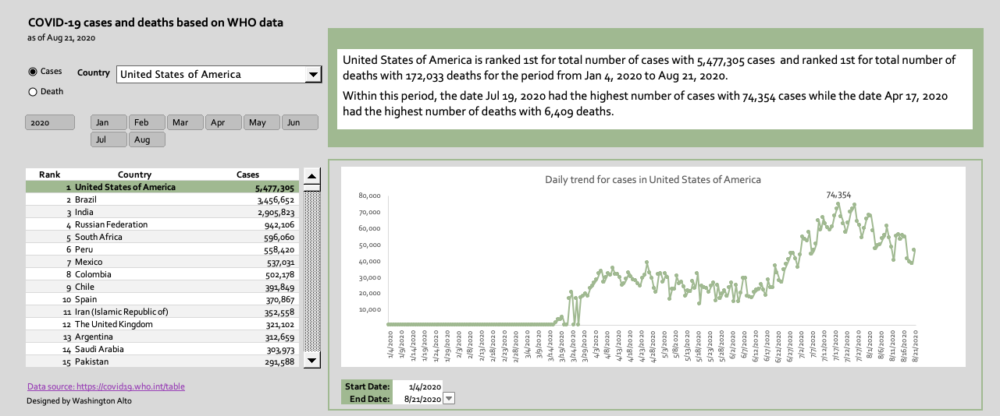
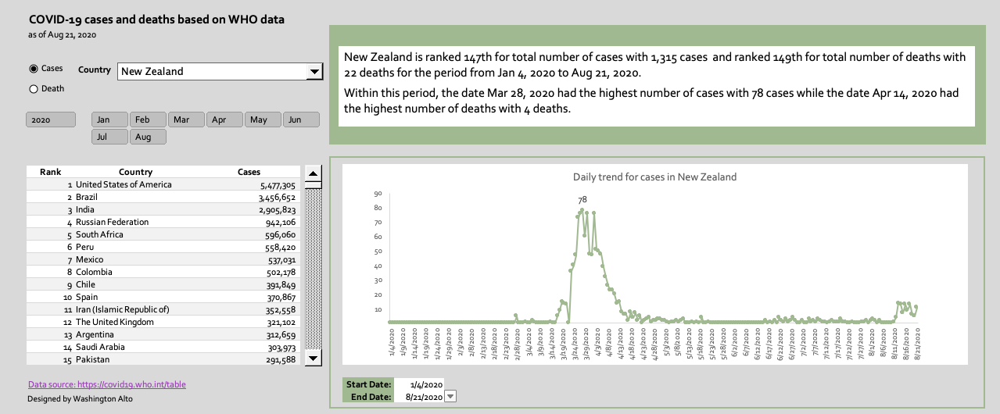

# COVID-19 cases and deaths based on WHO data 

## Description
This is a simple Excel dashboard that takes COVID-19 cases and deaths data from World Health Organization (WHO) to show how various countries rank in terms of cases and deaths and show daily trend per country. I created this dashboard as a personal project to apply what I've learned from the Udemy course [Visually Effective Dashboard](https://www.udemy.com/course/excel-dashboards-reports/) but thought I might as well share this work to others who might benefit from it. 

This is best used with Excel 2016 (or higher) and Excel 365 as it uses slicers which is available on Excel 2013 or higher version. I used Excel 2016 for Mac to create this file.    

## Download
You can download the latest Excel file from [link](https://github.com/washingtonalto/exceldashboards/blob/master/covid19/COVID-19%20Dashboard%20based%20on%20WHO%20data%20(shared).xlsm) (**Note** that the size of file is around 3 MB)
  
## Screenshots

The dashboard has month button (implemented using Excel slicer) that you can choose to change the report range. You can select multiple months if you wish. 

You can scroll down to view the countries using the scroll bar and you can select the country you like to be in focus from the drop down. Note that since data is coming from the World Health Organization (WHO), only countries recognized by WHO will appear in the drop down and so, Taiwan and Hong Kong data is noticeably not available from the dropdown. 

For the line chart, you can filter by selecting the start date and end date near the bottom of the chart.     

Clicking the button will download CSV data from [WHO COVID-19 table page](https://covid19.who.int/table) and directly update the table with the latest figure. 

  

This shows number of deaths instead of cases.

This shows number of cases for one month.

This shows number of cases but the line chart has different start and end dates.

This shows number of cases for US.

This shows number of cases for New Zealand.

